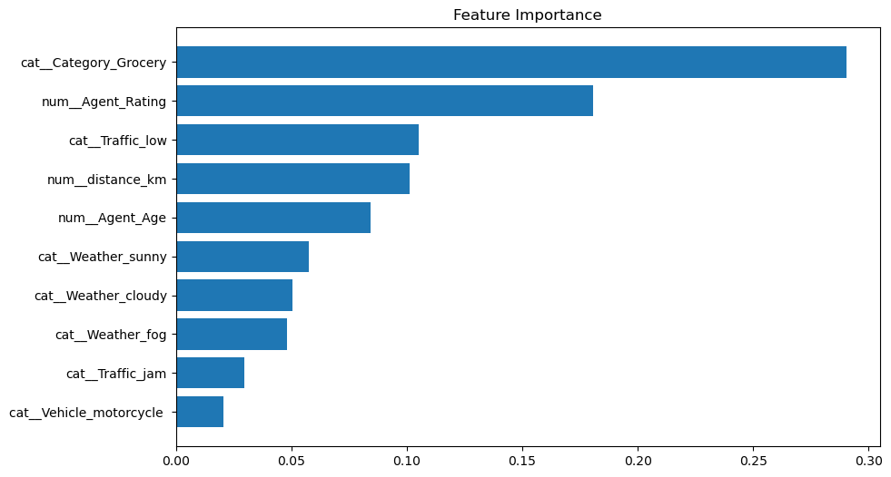
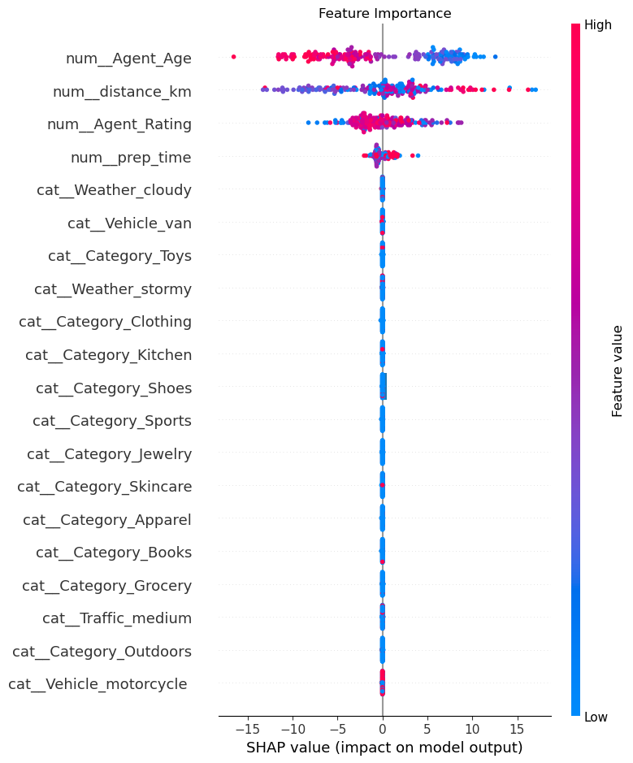

# 🚚 Amazon Delivery Time Prediction

## 💡 Highlights

- 🚀 End-to-end Machine Learning pipeline
- 📊 XGBoost with hyperparameter tuning (GridSearchCV)
- 🔁 5-fold cross-validation for robust evaluation
- 📈 Feature importance visualization
- 🔍 SHAP explainability for model interpretation
- 📦 MLflow experiment tracking
- 🌐 Interactive Streamlit web application
  
---

## 📊 Model Performance

- **Test RMSE:** ~22.3
- **Cross-Validation RMSE (5-fold):** ~22.3 ± 0.18

## 📊 Model Insights

## 📈 Feature Importance


## 🔍 SHAP Explainability


## 📌 Project Overview

This project focuses on predicting **delivery time for e-commerce orders** using Machine Learning.
It leverages real-world features such as **distance, traffic, weather, and agent performance** to build an accurate regression model.

The final solution includes:

* Data preprocessing & feature engineering
* Model training with MLflow tracking
* Explainability using SHAP  
* A user-friendly **Streamlit web application**

---

## 🎯 Business Objective

* Improve delivery time estimation accuracy
* Enhance customer satisfaction
* Optimize logistics and delivery operations
* Analyze impact of traffic, weather, and agent efficiency

---

## 🧠 Problem Statement

Predict the **Delivery_Time (in hours)** based on:

* Order details
* Delivery agent attributes
* External conditions (traffic, weather)
* Geographical distance

---

## 🗂️ Project Structure

```
amazon-delivery-prediction/
│
├── data/
│   ├── raw/
│   └── processed/
│
├── notebooks/
│   └── eda.ipynb
│
├── src/
│   ├── data_preprocessing.py
│   ├── feature_engineering.py
│   ├── train.py
│
├── models/
│   └── best_model.pkl
│
├── app/
│   └── app.py
│
├── assets/
│ ├── feature_importance.png
│ └── shap_summary.png
│
├── mlruns/        # MLflow logs
├── requirements.txt
└── README.md
```

---

## ⚙️ Tech Stack

* **Programming:** Python
* **Libraries:** pandas, numpy, scikit-learn, xgboost, shap
* **Visualization:** matplotlib, seaborn
* **Model Tracking:** MLflow
* **Web App:** Streamlit

---

## 🔄 Workflow

### 1. Data Preprocessing

* Removed duplicates & missing values
* Standardized categorical variables
* Applied outlier handling (IQR method)  

### 2. Feature Engineering

* 📍 **Distance Calculation (Haversine Formula)**
* ⏱️ **Preparation Time (Order → Pickup)**
* 📅 Time-based features (day, weekday)

### 3. Exploratory Data Analysis (EDA)

* Delivery time distribution
* Distance vs delivery time relationship
* Impact of traffic and weather

### 4. Model Development

* Built regression models:
  
  * Gradient Boosting
  * XGBoost (optional)
* Used **Pipeline + ColumnTransformer**
* Applied **GridSearchCV** for tuning

### 5. Model Evaluation

* Metrics used:

  * MAE (Mean Absolute Error)
  * RMSE (Root Mean Squared Error)
  * R² Score
* Applied **5-fold Cross-Validation** 

---

### 6. Model Explainability

- Used **SHAP (SHapley Additive Explanations)**  
- Identified feature impact on predictions  
- Visualized global feature importance 

### 7. Experiment Tracking

* Used **MLflow** to:

  * Log metrics
  * Compare models
  * Track hyperparameters

### 8. Deployment

* Built interactive UI using **Streamlit**
* Users can input delivery conditions and get predictions

---

## 🚀 How to Run the Project

### 1️⃣ Clone Repository

```
git clone https://github.com/your-username/amazon-delivery-prediction.git
cd amazon-delivery-prediction
```

### 2️⃣ Install Dependencies

```
pip install -r requirements.txt
```

### 3️⃣ Run Data Pipeline

```
python src/data_preprocessing.py
python src/feature_engineering.py
```

### 4️⃣ Train Model

```
python src/train.py
```

### 5️⃣ Run MLflow

```
mlflow ui
```

### 6️⃣ Launch App

```
streamlit run app/app.py
```

---

## 📊 Key Features

* ✅ End-to-end ML pipeline
* ✅ Feature engineering using geospatial data
* ✅ Automated preprocessing with Pipeline
* ✅ Hyperparameter tuning (GridSearchCV)
* ✅ Cross-validation for robust evaluation  
* ✅ Feature importance visualization  
* ✅ SHAP-based explainability 
* ✅ MLflow experiment tracking
* ✅ Interactive Streamlit UI

---

## 📈 Sample Input Features

* Agent Age & Rating
* Distance (calculated from coordinates)
* Preparation Time
* Weather Conditions
* Traffic Level
* Vehicle Type
* Area Type

---

## 🧪 Results

* Built multiple regression models and compared performance
* Identified key factors affecting delivery time:

  * Distance
  * Traffic conditions
  * Preparation time

### 🔍 Model Interpretability

SHAP analysis revealed that:

*  Distance is the most influential factor  
*  Traffic conditions significantly impact delivery time  
*  Preparation time strongly affects predictions 

---

## 🚀 Project Evolution

| Version | Improvement | Impact |
|--------|------------|--------|
| v1.0 | Baseline model | Initial pipeline |
| v1.1 | Feature engineering | Improved accuracy |
| v1.2 | Pipeline + preprocessing | Scalability |
| v1.3 | Hyperparameter tuning | Better performance |
| v1.4 | Code cleanup | Maintainability |
| v1.5 | Feature importance | Interpretability |
| v1.6 | Cross-validation | Robust evaluation |
| v1.7 | SHAP explainability | Model transparency |

---

## 🔮 Future Improvements

* Add real-time traffic API integration
* Deploy on cloud (AWS / GCP)
* Convert to REST API using FastAPI

---

## 👨‍💻 Author

**Shubham Pandey**
Data Science & ML Developer

---

## ⭐ If you found this project useful, consider giving it a star!
